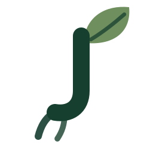

<div align="center">



# JATI.AI

### Jaringan Asisten Tani dan Iklim

**Berakar pada Pengetahuan, Tumbuh Bersama Keberlanjutan.**

Asisten cerdas berbasis AI yang mengubah informasi tani, iklim, dan alam yang rumit menjadi jawaban yang konkret, kontekstual, dan langsung bisa dipraktikkan.


</div>

---

## Daftar Isi

1. [Ringkasan](#1-ringkasan)
2. [Latar Belakang dan Masalah](#2-latar-belakang-dan-masalah)
3. [Solusi dan Keunikan](#3-solusi-dan-keunikan)
4. [Filosofi Nama](#4-filosofi-nama)
5. [Pengguna dan Cakupan Topik](#5-pengguna-dan-cakupan-topik)
6. [Fitur](#6-fitur)
7. [Arsitektur dan Alur Kerja](#7-arsitektur-dan-alur-kerja)
8. [Desain System Prompt](#8-desain-system-prompt)
9. [Konfigurasi dan Parameter](#9-konfigurasi-dan-parameter)
10. [Memulai](#10-memulai)
11. [Contoh Percakapan](#11-contoh-percakapan)
12. [Struktur Proyek](#12-struktur-proyek)
13. [Deploy ke Streamlit Community Cloud](#13-deploy-ke-streamlit-community-cloud)
14. [Identitas Visual](#14-identitas-visual)
15. [Keterbatasan dan Penggunaan yang Bertanggung Jawab](#15-keterbatasan-dan-penggunaan-yang-bertanggung-jawab)
16. [Pemenuhan Ketentuan Tugas](#16-pemenuhan-ketentuan-tugas)
17. [Arah Pengembangan](#17-arah-pengembangan)

---

## 1. Ringkasan

**JATI.AI** (*Jaringan Asisten Tani dan Iklim*) adalah chatbot berbasis kecerdasan buatan yang dikembangkan untuk menjembatani kesenjangan antara **informasi** tentang pertanian, perubahan iklim, dan keberlanjutan lingkungan dengan **kebutuhan nyata** masyarakat sehari-hari.

Pengguna cukup bertanya dengan bahasa sehari-hari. JATI.AI menghubungkan pertanyaan itu dengan konteks tani, iklim, dan alam, lalu menjawab dalam bahasa Indonesia yang sederhana, disertai langkah yang bisa langsung dikerjakan.

JATI.AI tersedia dalam dua antarmuka yang memakai satu inti logika yang sama (`jati_core.py`):

| Antarmuka | Perintah | Keterangan |
|-----------|----------|------------|
| **Web (Streamlit)** | `streamlit run app.py` | Tampilan visual lengkap dengan pengaturan, riwayat, dan statistik |
| **Console** | `python chatbot_console.py` | Versi terminal dengan perintah khusus |

---

## 2. Latar Belakang dan Masalah

Informasi tentang budidaya tanaman, perubahan iklim, dan pengelolaan lingkungan sebenarnya melimpah. Namun informasi itu:

- **tersebar** di berbagai sumber, seperti jurnal, laporan pemerintah, dan artikel;
- **menggunakan istilah teknis** yang sulit dipahami oleh orang di luar bidangnya;
- **sulit diterjemahkan menjadi tindakan** yang relevan dengan kondisi lahan dan kebutuhan pengguna.

Petani yang sedang menghadapi masalah di lahan membutuhkan jawaban yang **spesifik, singkat, dan bisa dikerjakan hari itu juga**, bukan definisi umum atau ringkasan akademik.

---

## 3. Solusi dan Keunikan

JATI.AI diposisikan sebagai **asisten pengetahuan yang berorientasi pada kebutuhan pengguna**, bukan sekadar chatbot yang memberikan definisi atau jawaban umum.

**Pendekatan jawaban.** JATI.AI tidak berhenti pada *"apa yang terjadi?"*, tetapi membantu pengguna memahami:

> **Mengapa** hal itu terjadi → **Apa dampaknya** → **Apa yang dapat dilakukan**

**Keunggulan utama:**

- **Bahasa sehari-hari.** Pengguna tidak perlu latar belakang akademik di bidang pertanian atau lingkungan. Istilah teknis selalu diberi penjelasan singkat.
- **Konkret dan kontekstual.** Jawaban berisi takaran, waktu, alat, atau urutan kerja, dengan konteks Indonesia: komoditas lokal, musim hujan dan kemarau, BMKG, BPP, dan kelompok tani.
- **Jawab dulu, tanya kemudian.** Saat pertanyaan kurang jelas, JATI.AI memberi jawaban umum yang berguna lebih dulu, lalu menutup dengan maksimal 1-2 pertanyaan singkat untuk memperdalam.
- **Penghubung pengetahuan dan keputusan.** AI diposisikan sebagai jembatan antara pengetahuan dan pengambilan keputusan, bukan sekadar penghasil teks.
- **Demokratisasi pengetahuan keberlanjutan.** Antarmuka percakapan yang sederhana membuka akses informasi lingkungan bagi siapa saja.
- **Jujur akan batasnya.** JATI.AI tidak memiliki data cuaca real-time, harga pasar terkini, atau citra satelit, sehingga pengguna diarahkan ke BMKG, Dinas Pertanian, atau penyuluh setempat. JATI.AI juga tidak mengarang angka, peraturan, atau hasil penelitian.
- **Mengutamakan keselamatan.** Setiap pembahasan pestisida, herbisida, dan pupuk kimia disertai pengingat alat pelindung diri, dosis sesuai label, dan masa tunggu sebelum panen. Solusi terpadu (pencegahan, musuh alami, rotasi tanaman) diutamakan lebih dulu.

---

## 4. Filosofi Nama

Pohon jati berakar kuat, mampu bertahan dalam berbagai kondisi lingkungan, tumbuh perlahan, dan bernilai jangka panjang. JATI.AI diharapkan menjadi teknologi yang **berakar pada kebutuhan masyarakat**, **tangguh menghadapi tantangan perubahan iklim**, dan **memberi manfaat jangka panjang**.

| Bagian Pohon | Makna dalam JATI.AI |
|--------------|--------------------|
| 🌱 **Akar** | **Pengetahuan**, yaitu fondasi informasi yang menjadi dasar setiap jawaban |
| 🪵 **Batang** | **Teknologi AI**, yaitu penyalur yang menghubungkan pengetahuan ke pengguna |
| 🌿 **Cabang** | **Persoalan tani, iklim, alam, dan keberlanjutan** yang dapat dijelajahi pengguna |

Logo JATI.AI mengikuti filosofi yang sama: huruf **"J"** yang membentuk batang dan akar pohon, dengan sehelai daun di ujung atas.

---

## 5. Pengguna dan Cakupan Topik

**Pengguna**

- **Primer:** petani, penyuluh, dan pelaku sektor agrikultur di Indonesia.
- **Sekunder:** masyarakat umum yang ingin memahami isu iklim, konservasi alam, penggunaan sumber daya, dan gaya hidup berkelanjutan.

**Cakupan topik**

| Kategori | Cakupan pembahasan |
|----------|--------------------|
| 🌾 **Tani** | budidaya tanaman, pemilihan varietas, pengolahan tanah, pemupukan, hama dan penyakit, irigasi, pasca panen, pertanian organik/regeneratif, hitungan biaya sederhana |
| 🌦️ **Iklim** | musim hujan dan kemarau, El Nino/La Nina, kalender tanam, adaptasi cuaca ekstrem, kekeringan, banjir, emisi gas rumah kaca dari pertanian |
| 🌿 **Alam** | keberlanjutan lingkungan, kesehatan tanah, air, keanekaragaman hayati, agroforestri, pengelolaan sampah organik, konservasi, restorasi lahan |

Pertanyaan di luar ketiga ranah tersebut (misalnya tugas kuliah umum, gosip, atau coding) ditolak dengan sopan dalam satu kalimat, lalu JATI.AI menawarkan bantuan yang masih di ranahnya.

---

## 6. Fitur

**Inti**

- Percakapan berbahasa Indonesia dengan *system prompt* khusus tema tani, iklim, dan alam
- Pengelolaan riwayat percakapan (*conversation history*) dengan pemangkasan otomatis untuk menghemat token
- Penanganan error yang menerjemahkan masalah teknis menjadi pesan ramah, tanpa membuat aplikasi *crash*

**Tambahan**

- **Streaming response.** Jawaban muncul bertahap seperti diketik langsung (`stream_jawaban()`).
- **Tiga pilihan model** Groq yang bisa dipilih dari sidebar web.
- **Antarmuka web** dengan sidebar topik, contoh pertanyaan, dan identitas visual sendiri.
- **Simpan dan muat riwayat** dalam format JSON, serta unduh percakapan langsung dari browser.
- **Statistik percakapan:** jumlah pertanyaan dan jawaban, jumlah kata, panjang rata-rata jawaban, dan topik dominan.
- **Kontrol parameter:** pilihan model, *temperature*, dan panjang jawaban maksimal.
- **7 perintah khusus** pada versi console.

---


### Statistik percakapan

`statistik()` mengembalikan `pertanyaan`, `jawaban`, `kata_ditulis_pengguna`, `kata_dijawab_jati`, `rata_rata_panjang_jawaban`, `skor_topik`, dan `topik_utama`. Topik dominan dihitung dengan **pencocokan kata kunci** pada pertanyaan pengguna untuk kategori Tani, Iklim, dan Alam, sehingga sifatnya perkiraan sederhana, bukan klasifikasi model.

---

## 7. Desain System Prompt

Kepribadian JATI.AI didefinisikan lewat `SYSTEM_PROMPT` dan terdiri atas lima bagian:

| Bagian | Isi |
|--------|-----|
| **Identitas** | JATI.AI, asisten digital berbahasa Indonesia dengan tagline *"Teman Cerdas untuk Tani, Iklim, dan Alam"* |
| **Pengguna** | petani, penyuluh, dan pelaku agrikultur (primer); masyarakat umum (sekunder) |
| **Topik** | Tani, Iklim, dan Alam, dengan subtopik seperti pada [bagian 5](#5-pengguna-dan-cakupan-topik) |
| **Gaya menjawab** | bahasa sederhana dan ramah; istilah teknis dijelaskan dalam kurung; 2-5 paragraf pendek atau poin bernomor untuk langkah; selalu ada langkah konkret; konteks Indonesia; maksimal satu emoji per jawaban; ditutup dengan satu saran lanjutan bila relevan |
| **Batasan** | tanpa data real-time (cuaca, harga, citra satelit); tidak mengarang statistik, peraturan, atau hasil penelitian; keselamatan penggunaan pestisida dan pupuk kimia; tidak menyarankan bahan aktif terlarang; menolak topik di luar ranah; selalu mengaku sebagai JATI.AI |

---

## 8. Konfigurasi dan Parameter

**Nilai bawaan** (di bagian atas `jati_core.py`):

| Parameter | Nilai | Keterangan |
|-----------|-------|-----------|
| `MODEL_DEFAULT` | `openai/gpt-oss-120b` | model utama |
| `TEMPERATURE_DEFAULT` | `0.6` | cukup luwes, tetapi tetap konsisten untuk informasi teknis |
| `MAX_TOKENS_DEFAULT` | `1200` | batas panjang jawaban |
| `MAX_PESAN_KONTEKS` | `12` | jumlah pesan terakhir yang dikirim ulang ke API (sekitar 6 putaran tanya-jawab) |
| `FOLDER_RIWAYAT` | `riwayat/` | lokasi penyimpanan percakapan |

**Model yang tersedia** (dapat dipilih di sidebar versi web):

| Model | Karakter |
|-------|----------|
| `openai/gpt-oss-120b` | paling pintar (bawaan) |
| `openai/gpt-oss-20b` | lebih ringan dan cepat |
| `llama-3.3-70b-versatile` | alternatif |

**Kontrol di antarmuka web:** *temperature* 0.0-1.2 (nilai kecil lebih konsisten, nilai besar lebih kreatif) dan panjang jawaban maksimal 400-2000 token.

> Daftar model Groq terbaru tersedia di <https://console.groq.com/docs/models>. Jika model tidak lagi tersedia, JATI.AI akan menampilkan petunjuk untuk menggantinya.

---

## 9. Memulai

### Prasyarat

- **Python 3.9+** (disarankan 3.11)
- **Visual Studio Code** atau editor lain
- **API key Groq** (gratis) dari <https://console.groq.com/keys>

**Dependensi utama** (sudah tercantum di `requirements.txt`): `groq`, `python-dotenv`, dan `streamlit` versi 1.39 atau lebih baru.

### Langkah 1: Buka proyek

Buka folder proyek di VS Code lewat **File → Open Folder → jati-ai**, lalu buka terminal lewat **Terminal → New Terminal**.

### Langkah 2: Buat virtual environment (opsional, disarankan)

```bash
# Windows
python -m venv .venv
.venv\Scripts\activate

# macOS / Linux
python3 -m venv .venv
source .venv/bin/activate
```

### Langkah 3: Install dependensi

```bash
pip install -r requirements.txt
```

### Langkah 4: Atur API key

Salin `.env.example` menjadi `.env`, lalu isi tanpa tanda kutip dan tanpa spasi:

```env
GROQ_API_KEY=gsk_xxxxxxxxxxxxxxxxxxxxxxxxxxxxxxxx
```

> API key tidak pernah ditulis di dalam kode. File `.env` sudah terdaftar di `.gitignore`, jadi tidak ikut terunggah ke GitHub.

### Langkah 5: Jalankan

> Jalankan perintah dari **folder utama proyek**, karena folder `riwayat/` dibuat relatif terhadap lokasi Anda menjalankan program.

**Versi web (Streamlit)**

```bash
streamlit run app.py
```

Browser akan terbuka otomatis di `http://localhost:8501`. Jika tidak, salin alamat yang muncul di terminal.

**Versi console**

```bash
python chatbot_console.py
```

### Perintah khusus pada versi console

| Perintah | Fungsi |
|----------|--------|
| `/keluar` atau `/exit` | keluar dari chatbot (riwayat otomatis disimpan) |
| `/baru` atau `/clear` | hapus riwayat dan mulai percakapan baru |
| `/simpan` | simpan percakapan ke `riwayat/*.json` |
| `/muat` | pilih dan lanjutkan percakapan lama |
| `/statistik` | ringkasan jumlah pesan dan topik yang paling sering dibahas |
| `/suhu 0.8` | ubah *temperature* (0.0 = konsisten, 1.5 = kreatif) |
| `/bantuan` | tampilkan daftar perintah |

---

## 10. Contoh Percakapan

```text
Anda  > Padi saya menguning di ujung daun, apa penyebabnya?

JATI  > Daun padi yang menguning mulai dari ujung biasanya menandakan tiga hal
        yang paling sering terjadi di lapangan:

        1. Kekurangan nitrogen ...
        2. Keracunan besi pada sawah yang tergenang terus ...
        3. Serangan penyakit hawar daun bakteri ...

        Supaya lebih tepat, boleh tahu tanaman padinya sudah umur berapa minggu,
        dan apakah sawahnya tergenang terus atau sempat dikeringkan?
```

### Tampilan antarmuka

<!--
Setelah screenshot disimpan di folder assets/screenshots/, hapus tanda komentar
pada blok di bawah ini.

| Halaman awal | Percakapan |
|:---:|:---:|
|  |  |

| Versi console |
|:---:|
|  |
-->

---

## 11. Struktur Proyek

```text
jati-ai/
├── jati_core.py          # OTAK: seluruh logika inti chatbot
├── chatbot_console.py    # Antarmuka 1: versi terminal
├── app.py                # Antarmuka 2: versi web (Streamlit)
├── requirements.txt      # daftar library
├── .env                  # API key (rahasia, tidak diunggah)
├── .env.example          # contoh isi .env untuk orang lain
├── .gitignore            # menjaga .env agar tidak ikut ter-push
├── .streamlit/
│   └── config.toml       # tema terang Streamlit sesuai identitas JATI
├── assets/
│   ├── logo.svg          # logo huruf "J" berbentuk batang dan akar + daun
│   ├── logo_light.svg    # versi terang untuk latar hijau tua
│   └── logo.png          # favicon dan avatar chatbot
└── riwayat/              # berkas JSON percakapan (dibuat otomatis saat menyimpan)
```

---

## 12. Deploy ke Streamlit Community Cloud

1. Push proyek ke repository GitHub yang **public**. Pastikan `.env` tidak ikut ter-push.
2. Buka <https://share.streamlit.io> dan login dengan akun GitHub.
3. Klik **New app**, pilih repository dan branch, lalu isi *Main file path* dengan `app.py`.
4. Buka **Advanced settings → Secrets**, lalu tempel:

   ```toml
   GROQ_API_KEY = "gsk_xxxxxxxxxxxxxxxxxxxx"
   ```

5. Klik **Deploy**. Aplikasi akan mendapat alamat publik, misalnya `https://jati-ai.streamlit.app`.

> Di Streamlit Cloud, `st.secrets` otomatis tersedia sebagai environment variable, sehingga `os.getenv("GROQ_API_KEY")` di `muat_api_key()` tetap berfungsi tanpa perubahan kode.

> Penyimpanan di folder `riwayat/` pada Streamlit Cloud bersifat sementara dan dapat hilang saat aplikasi dimulai ulang. Gunakan tombol **Unduh percakapan (JSON)** untuk menyimpan percakapan penting.

---

## 13. Identitas Visual

Palet warna didefinisikan di `WARNA` pada `jati_core.py` dan dipakai bersama oleh `app.py` dan console.

| Warna | Hex | Penggunaan |
|-------|-----|-----------|
| Forest Green | `#173F2F` | identitas utama, sidebar, bubble pengguna |
| Leaf Green | `#6F8F5F` | elemen sekunder, hover, fokus input |
| Sage Light | `#DCE8D4` | teks pendukung di atas hijau tua, aksen lembut |
| Warm Ivory | `#F6F4EC` | latar utama |
| Climate Teal | `#2F6F73` | tagline, elemen iklim dan data |
| Earth Accent | `#D98E5B` | peringatan ringan |
| Dark Text | `#22332B` | teks utama |
| White | `#FFFFFF` | kartu, input, bubble jawaban JATI, teks di atas hijau tua |

**Tipografi:** Segoe UI (cadangan: Helvetica Neue dan Arial).

**Logo:** huruf "J" yang membentuk batang dan akar pohon dengan sehelai daun di ujung atas, menyatukan nama JATI dan filosofi pohon jati dalam satu simbol.

---

## 14. Keterbatasan dan Penggunaan yang Bertanggung Jawab

- JATI.AI **tidak terhubung** ke data cuaca, harga pasar, atau citra satelit secara real-time.
- Jawaban dapat keliru. Untuk keputusan penting di lahan, tetap pertimbangkan kondisi lokal dan konsultasikan dengan **penyuluh pertanian setempat** atau sumber resmi seperti **BMKG**.
- Konteks percakapan dipangkas otomatis: hanya **12 pesan terakhir** (sekitar 6 putaran tanya-jawab) yang dikirim ke model, sehingga hal yang dibahas jauh di awal percakapan bisa terlupa.
- Panduan penggunaan pestisida dan pupuk kimia bersifat umum. Selalu ikuti label produk dan anjuran keselamatan.
- Deteksi topik pada statistik berbasis kata kunci, sehingga hanya perkiraan kasar.
- Ketersediaan model bergantung pada Groq. Model dapat dihentikan sewaktu-waktu dan perlu diganti.

---

## 15. Pemenuhan Ketentuan Tugas

| Ketentuan | Status | Keterangan |
|-----------|:------:|-----------|
| Berjalan di console/terminal  | `chatbot_console.py` |
| Menggunakan API LLM (bukan model lokal)  | Groq API, model bawaan `openai/gpt-oss-120b` |
| Punya *system prompt* sesuai tema | `SYSTEM_PROMPT` di `jati_core.py` |
| Mengelola *conversation history* | list `messages`, `reset_history()`, dan `potong_history()` |
| Penanganan error | `JatiError`, `_pesan_error()`, dan pembuangan pertanyaan terakhir saat gagal |
| Minimal 2 perintah khusus | 7 perintah (`/keluar`, `/baru`, `/simpan`, `/muat`, `/statistik`, `/suhu`, `/bantuan`) |
| **Bonus:** tampilan web | Streamlit (`app.py`) |
| **Bonus:** streaming response | `stream_jawaban()`, dipakai di console dan web |
| **Bonus:** simpan dan muat riwayat | JSON di folder `riwayat/` |
| **Bonus:** statistik percakapan | `statistik()` |
| **Bonus:** kontrol parameter | *temperature*, panjang jawaban, dan tiga pilihan model |
| API key tidak ada di dalam kode | `.env` dan `.gitignore` |

---

## 16. Arah Pengembangan

Gagasan pengembangan berikutnya, sejalan dengan keterbatasan yang sudah diidentifikasi:

- [ ] Integrasi data cuaca dan peringatan dini dari sumber resmi (misalnya BMKG)
- [ ] Dukungan tanya-jawab berbasis foto tanaman untuk membantu identifikasi hama dan penyakit
- [ ] Penyesuaian jawaban berdasarkan lokasi dan jenis lahan pengguna
- [ ] Deteksi topik yang lebih akurat pada statistik percakapan
- [ ] Basis pengetahuan terkurasi dari sumber terpercaya agar jawaban lebih terverifikasi

---

<div align="center">

**JATI.AI — Berakar pada Pengetahuan, Tumbuh Bersama Keberlanjutan.** 🌱

*Dibuat untuk tugas mata kuliah Sains Data Terapan.*

</div>
